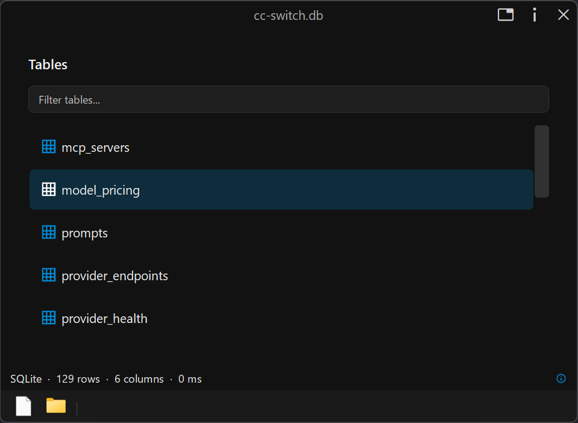
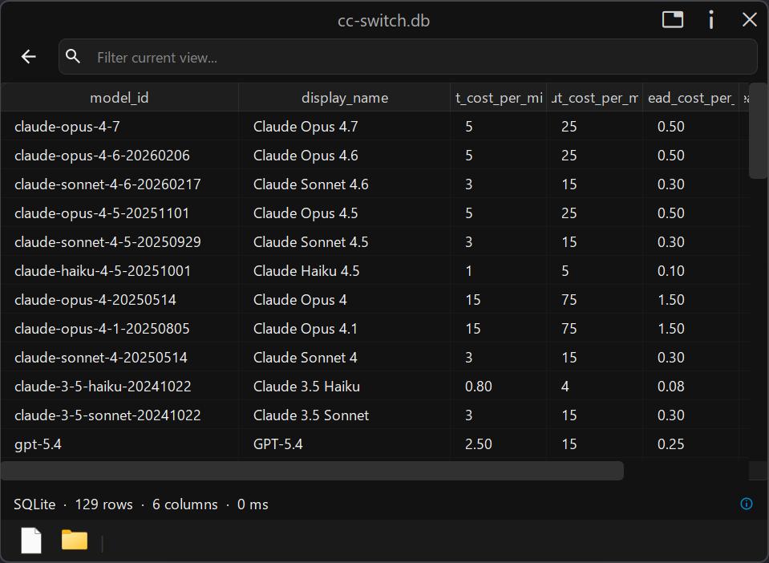

# DataTableViewer

**A tabular data viewer for Windows** - built as a native plugin for
[Seer](https://1218.io), the quick-look file preview tool.

DataTableViewer lets you preview CSV, TSV, and SQLite files in a fast read-only
table view. Press Space on a supported file in Seer to inspect rows, search
values, sort columns, and copy selected cells without opening a spreadsheet or
database tool.

## Features

- **CSV and TSV preview**: header detection, quoted-field handling, BOM stripping, and tab/comma support
- **SQLite preview**: browse database tables, pick one, then preview rows
- **Interactive table view**: sortable columns, movable/resizable headers, alternating rows, and TSV copy
- **Type-aware sorting**: numeric columns sort by numeric value instead of plain text
- **Live filtering**: search across the current table while keeping the UI responsive
- **Status bar metrics**: format, row count, column count, file size, load time, warnings, and truncation hints
- **Async parsing**: background-thread parsing and cancellation keep Seer responsive while switching files

## Screenshots

## Supported Formats

- `.csv`
- `.tsv`
- `.sqlite`
- `.sqlite3`
- `.db`
- `.db3`
- `.sl3`

## Building

Requirements:

- Qt 6.8
- CMake 3.16+
- Visual Studio 2022 or newer with MSVC
- vcpkg, available through `VCPKG_ROOT`

SQLite is consumed through the vcpkg manifest in `vcpkg.json`. The checked-in
CMake preset uses the `x64-windows-static-md` triplet so SQLite is linked into
`datatableviewer.dll` while keeping the MSVC runtime dynamic and compatible with
Qt. This avoids shipping a separate `sqlite3.dll` with the plugin.

Recommended Visual Studio flow:

1. Clone this repository.
2. Open the repository folder in Visual Studio with **File -> Open -> Folder**.
3. Let Visual Studio configure the CMake project.
4. Set `datatableviewer_test` as the startup item.
5. Build or run `datatableviewer_test`.

The plugin build produces:

- `datatableviewer.dll` - the Seer plugin
- `plugin.json` - copied next to the DLL after build

Parser tests are available through the CMake target `run_all_tests`.

## Use With Seer

[Seer](https://1218.io) is a quick-look file preview tool for Windows: press
Space on a file to preview it without opening a full application.

1. Install [Seer](https://1218.io).
2. In Seer, open **Settings -> Plugins**.
3. Install or place the DataTableViewer plugin files.
4. Ensure `datatableviewer.dll` and `plugin.json` are in the same plugin folder.
5. Press Space on a supported CSV, TSV, or SQLite file.

SQLite support is statically linked into `datatableviewer.dll`; no separate
SQLite runtime DLL is required in the plugin folder.

## Development Notes

Operational project rules live in [AGENTS.md](AGENTS.md). Use it for architecture,
format registration, lifecycle, threading, and release-check expectations.

## TODO: 
- control bar btn: view in Text viewer