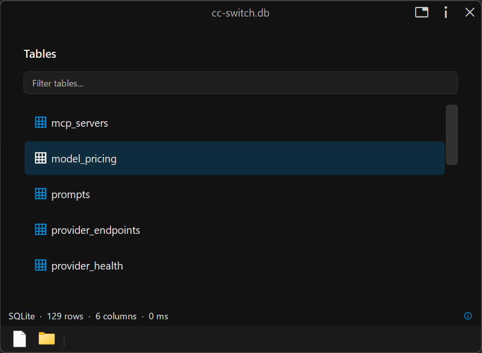
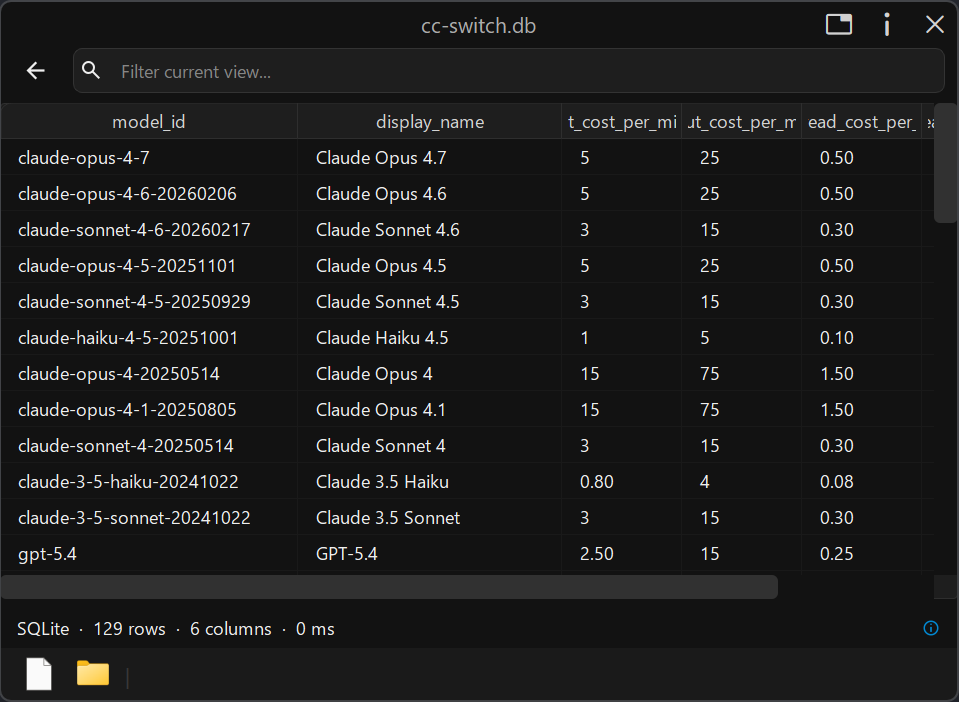

# DataTableViewer

**A tabular data viewer for Windows** - built as a native plugin for
[Seer](https://1218.io), the quick-look file preview tool.

DataTableViewer lets you preview CSV, TSV, and SQLite files in a fast read-only
table view. Press Space on a supported file in Seer to inspect rows, search
values, sort columns, and copy selected cells without opening a spreadsheet or
database tool.

## Features

- **CSV and TSV paging**: bounded-memory paging backed by disk offset indexing, handling large files (>64 MiB, 100k+ rows) without memory exhaustion or truncation
- **SQLite preview**: browse database tables, pick one, then page through large tables without loading the whole database
- **Table paging**: configurable page size, asynchronous row counts and index progress, and current-page-only filtering
- **Interactive table view**: sortable columns, movable/resizable headers, alternating rows, and TSV copy
- **Type-aware sorting**: numeric columns sort by numeric value instead of plain text
- **Live filtering**: search across the current table while keeping the UI responsive
- **Status bar metrics**: format, row count, column count, file size, load time, warnings, and paging progress
- **Async parsing**: background-thread parsing and cancellation keep Seer responsive while switching files

## Screenshots




## Supported Formats

- `.csv`
- `.tsv`
- `.sqlite`
- `.sqlite3`
- `.db`
- `.db3`
- `.sl3`

## Paging, Sorting & Resource Bounds

- **Paged CSV and TSV preview**: Large files are indexed into a temporary binary disk index in the background without reading the entire file into RAM. The first page renders in < 500 ms while background indexing continues in 256 KiB slices. Single-page files (`total <= pageSize`) hide the pager bar.
- **Sorting behavior**: Full-file sorting is available for SQLite tables with a usable rowid and small in-memory tables. Full-file sorting is unsupported for paged CSV/TSV files; clicking a column header displays an explanation in the status bar (`"Sorting is not supported for paged CSV/TSV files"`) without reordering rows or showing sort indicators.
- **Resource limits**: Decoded table cells are bounded to 32 MiB per page with dynamic cell clamping at valid UTF-8 code point boundaries. Clamped cells are refetched asynchronously during clipboard copy up to an aggregate 64 MiB payload budget.

## Building

Requirements:

- Qt 6.8
- CMake 3.16+
- Visual Studio 2022 or newer with MSVC
- vcpkg, available through `VCPKG_ROOT`

SQLite is consumed through the vcpkg manifest in `vcpkg.json`. The checked-in
CMake preset uses the `x64-windows-static-md` triplet so SQLite is linked into
`datatableviewer.dll` while keeping the MSVC runtime dynamic and compatible with
Qt. This avoids shipping a separate `sqlite3.dll` with the plugin.

Recommended Visual Studio flow:

1. Clone this repository.
2. Open the repository folder in Visual Studio with **File -> Open -> Folder**.
3. Let Visual Studio configure the CMake project.
4. Set `datatableviewer_test` as the startup item.
5. Build or run `datatableviewer_test`.

The plugin build produces:

- `datatableviewer.dll` - the Seer plugin
- `plugin.json` - copied next to the DLL after build

Parser tests are available through the CMake target `run_all_tests`.

## Use With Seer

[Seer](https://1218.io) is a quick-look file preview tool for Windows: press
Space on a file to preview it without opening a full application.

1. Install [Seer](https://1218.io).
2. In Seer, open **Settings -> Plugins**.
3. Install or place the DataTableViewer plugin files.
4. Ensure `datatableviewer.dll` and `plugin.json` are in the same plugin folder.
5. Press Space on a supported CSV, TSV, or SQLite file.

SQLite support is statically linked into `datatableviewer.dll`; no separate
SQLite runtime DLL is required in the plugin folder.

## Configuration & Shortcuts

Settings are stored in `DataTableViewer.ini` located in the plugin DLL directory. If the plugin directory is read-only, compiled defaults remain active.

Keyboard shortcuts can be customized in the `[Shortcuts]` section:

```ini
[Shortcuts]
DataTableViewer.find=Ctrl+F
DataTableViewer.copy=Ctrl+C
DataTableViewer.viewText=Ctrl+Alt+T
DataTableViewer.pageFirst=Ctrl+Home
DataTableViewer.pagePrev=Ctrl+PageUp
DataTableViewer.pageNext=Ctrl+PageDown
DataTableViewer.pageLast=Ctrl+End
```

### Action Reference

| Action ID | Description | Default Shortcut |
|---|---|---|
| `DataTableViewer.find` | Focus and select search bar filter | `Ctrl+F` |
| `DataTableViewer.copy` | Copy selected cells to clipboard | `Ctrl+C` |
| `DataTableViewer.viewText` | Open current file in Seer Text viewer | `Ctrl+Alt+T` |
| `DataTableViewer.pageFirst` | Jump to first page | `Ctrl+Home` |
| `DataTableViewer.pagePrev` | Navigate to previous page | `Ctrl+PageUp` |
| `DataTableViewer.pageNext` | Navigate to next page | `Ctrl+PageDown` |
| `DataTableViewer.pageLast` | Jump to last page | `Ctrl+End` |

- **Storage & syntax:** Values use portable key sequence format (e.g., `Ctrl+F`, `Ctrl+Shift+C`).
- **Fallback behavior:** Missing, empty, or unparsable keys fall back to their compiled defaults. If two actions share the same shortcut, a warning is logged once and both actions retain the assignment.
- **Read timing:** Configuration is synchronized on viewer initialization and applies on the next file preview. Live in-flight shortcut refresh is not performed.
- **Read-only directories:** When the plugin directory is read-only, default settings cannot be written to disk; compiled defaults remain active and a warning is logged once.

## Development Notes

Operational project rules live in [AGENTS.md](AGENTS.md). Use it for architecture,
format registration, lifecycle, threading, and release-check expectations.